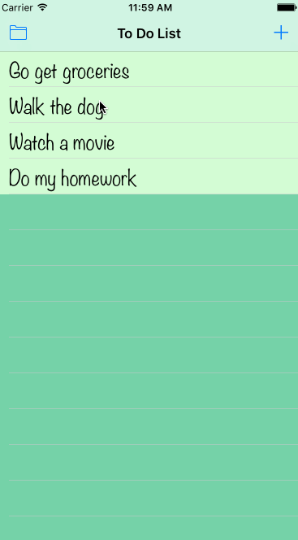

# ToDo App

**ToDo** is an iOS app built to learn the concepts of some of XCode's core features (e.g. ViewController, Seque, TableViewController, Delegates, etc).

## User Stories

The following features are implemented:
  
- [x] Allow users to add to do items
- [x] Users can delete items by marking them
- [x] Empty spaces in text field will not be added as an item

## DEMO

